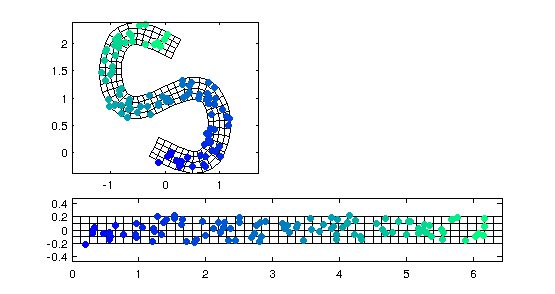

# xy2sn

Analysing or interpolating scattered data that follow a common centerline, like bathymetry data in a river, may require interpreting the data in terms of their position along and distance from that centerline. For example, river bathymetry varies more strongly laterally to the river centerline than longitudinally.

This package provides functions to transform between cartesian (xy) and curvilinear orthogonal (sn) coordinates using a spline representation of a centerline.

The approach is based on [Merwade et al (2005) "Geospatial Representation of River Channels", Journal of Hydrological Engineering, 10, 243-251](http://ascelibrary.org/doi/abs/10.1061/(ASCE)1084-0699(2005)10:3(243)).

The code depends on John D'Erricos [distance2curve](http://www.mathworks.com/matlabcentral/fileexchange/34869-distance2curve), [arclength](http://www.mathworks.com/matlabcentral/fileexchange/34871-arclength) and [interparc](http://www.mathworks.com/matlabcentral/fileexchange/34874-interparc) functions.
